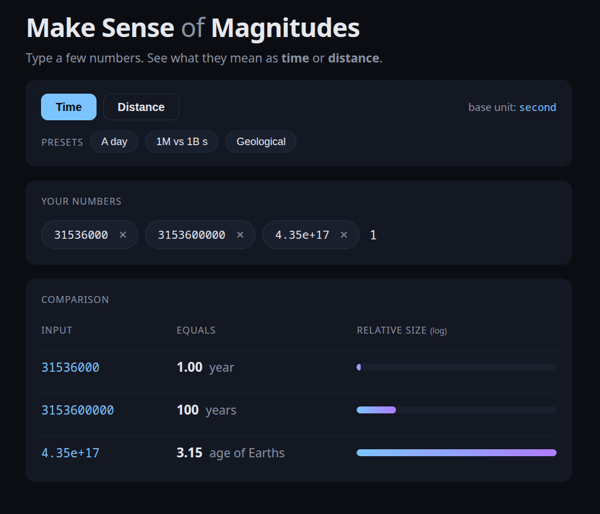

## Idea
Did you ever thought what is the difference in magnitude between one million and one billion then
to be told the classic example that one billion is 31 years where one million is merely an 11 days


# Showcase 




# How to run

Requires **Go 1.25+** and **Node 20+**.

```sh
make install   # one-time: installs frontend dependencies
make run       # starts Go server on :8080 and Vite on :5173
```

Open <http://127.0.0.1:5173>. The frontend talks to the Go API through the
Vite dev-server proxy, so there is nothing else to configure.

To stop both processes, press **Ctrl-C** once — `make run` traps it and kills
both children.


## Other make targets

| target        | what it does                                          |
|---------------|-------------------------------------------------------|
| `make run`    | installs deps if needed, runs server + frontend       |
| `make install`| `npm install` in `frontend/`                          |
| `make build`  | `npm run build` in `frontend/` (production bundle)    |
| `make srv`    | runs only the Go server on `:8080`                    |
| `make cli`    | runs the CLI tool under `src/cmd/cli/`                |


# How to use

Pick a mode (**Time** or **Distance**), type some numbers, press **Enter** or
**,** after each one. Paste a comma- or space-separated list — it splits
automatically. Click a chip's **×** to remove it, or press **Backspace** on an
empty input to remove the last chip.

Each row in the **Comparison** table shows the best-fit unit for that number:

- **Time** — `1_000_000` s → `1.65 weeks` (≈11.5 days), `1_000_000_000` s → `31.71 years`
- **Distance** — `1_000` mm → `1 meter`, `384_400_000_000` mm → `1.08 Earth to Moon`

The bar on the right is log-scaled so all values fit on screen at once.


# API

The Go server exposes two pairs of endpoints. All accept `POST` with a JSON
body `{"values": [..numbers..]}` and return `{"results": [...]}`.

| endpoint                          | behaviour                                                   |
|-----------------------------------|-------------------------------------------------------------|
| `POST /convert/time`              | **relative** — picks a unit using `scales[0]` as the base   |
| `POST /convert/distance`          | **relative** — same, for distance units                     |
| `POST /absolute/convert/time`     | **absolute** — picks the best unit for each value           |
| `POST /absolute/convert/distance` | **absolute** — same, for distance units                     |
| `GET  /health`                    | health check                                                |

Example:

```sh
curl -X POST http://127.0.0.1:8080/absolute/convert/time \
  -H 'Content-Type: application/json' \
  -d '{"values":[1000000, 1000000000]}'
```

```json
{
  "results": [
    {"OriginalValue": 1000000,   "ScaledValue": 1.65,  "UnitName": "week"},
    {"OriginalValue": 1000000000,"ScaledValue": 31.71, "UnitName": "year"}
  ]
}
```

Use **relative** mode when `scales[0]` is a reference (e.g. a viewport) and the
rest are objects to be sized against it. Use **absolute** for the comparison
use case described in the Idea section above.
